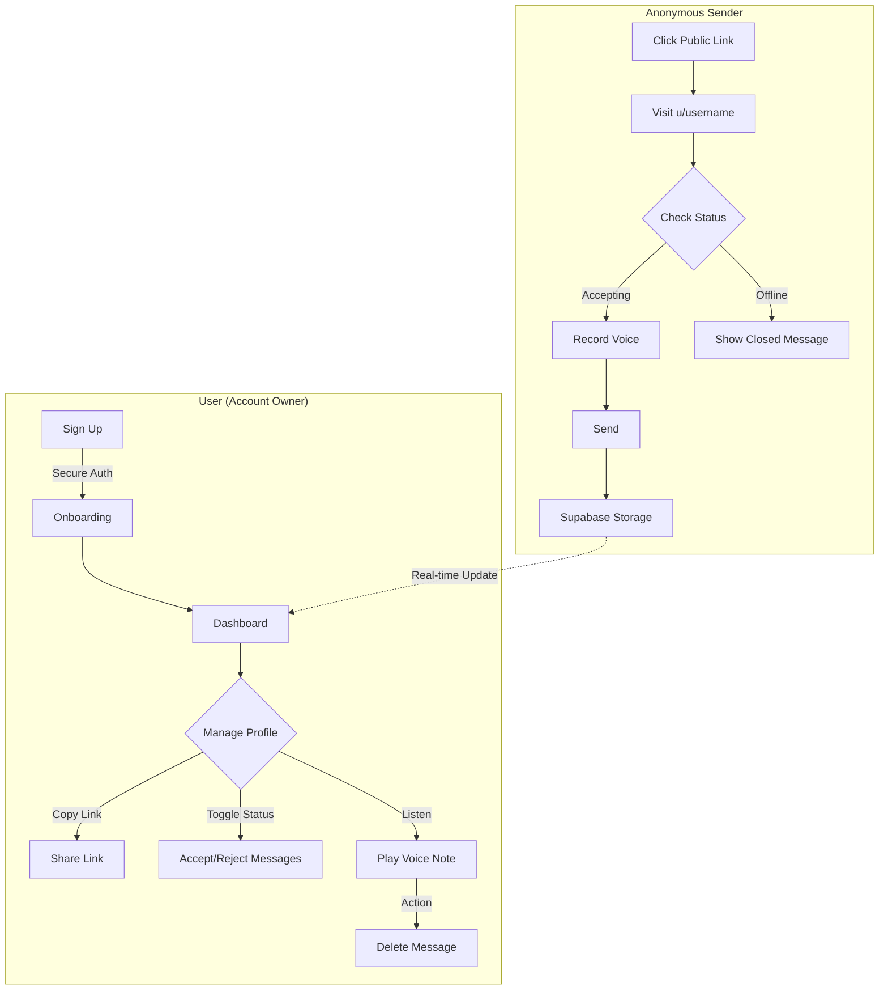

# Audiox: The Anonymous Voice Messaging Platform

**Audiox** is a privacy-focused, real-time anonymous voice messaging application. Users can create a profile, share their unique link, and receive honest, anonymous voice notes from others. It features a sleek, immersive interface designed to make listening as engaging as recording.

<div align="center">
  
  
  
  
</div>

## Overview

**Text loses tone.** In a world of sterile text messages, the nuance of human emotion is often lost. Sarcasm, sincerity, and hesitation vanish in plain text.

**Audiox restores the human element.** It creates a secure channel where identity is decoupled from the voice. You provide the platform, and your network provides the truth—spoken aloud. Whether for constructive feedback, anonymous confessions, or heartfelt messages, Audiox ensures the emotion is heard, not just read.

You simply claim your unique corner of the web, share your link, and watch as your dashboard fills with voice notes you might never hear otherwise—all managed through a powerful, real-time interface.

## Core Features

Audiox is built to make the experience of receiving voice feedback not just useful, but effortless and visually stunning.

| Feature                        | Description                                                                                                                                   |
| :----------------------------- | :-------------------------------------------------------------------------------------------------------------------------------------------- |
| **Voice-First Anonymity**      | No sign-up required for senders. One-tap recording removes barriers between your audience's thought and your inbox.                           |
| **Real-Time Feed**             | **Listen as they speak.** Your dashboard updates instantly as new voice notes arrive.                                                         |
| **Smart Availability Control** | You are in charge. Instantly toggle **"Accepting Messages"** on or off. When off, your public page politely informs visitors you are offline. |
| **Immersive Audio UI**         | Experience sound visually. Audiox features **premium waveforms**, smooth playback controls, and a design that moves with the music.           |
| **Smooth Animations**          | Powered by **GSAP** and **Framer Motion**, every interaction feels fluid, from page transitions to micro-interactions.                        |
| **Secure Authentication**      | Enterprise-grade protection using **NextAuth.js (v5 Beta)**, ensuring only _you_ can listen to your messages.                                 |
| **Seamless Device Sync**       | precise control on desktop or quick listening on mobile, the responsive design ensures a perfect experience anywhere.                         |

## The Flow

The application follows a secure and straightforward workflow for both account owners and anonymous senders.



## Tech Stack

- **Framework**: Next.js 16.1 (App Router)
- **Language**: TypeScript
- **Styling**: Tailwind CSS v4, Framer Motion, GSAP
- **Icons**: Hugeicons React, Lucide React
- **Database & Storage**: Supabase
- **Authentication**: NextAuth.js v5 Beta
- **Validation**: Zod
- **Audio**: use-sound

## Getting Started

Follow these steps to get Audiox running on your local machine.

### Prerequisites

- Node.js (v20 or later recommended)
- Supabase Project (Database & Storage)

### 1. Clone the Repository

```bash
git clone https://github.com/yourusername/audiox.git
cd audiox
```

### 2. Install Dependencies

```bash
npm install
```

### 3. Environment Variables

Create a `.env.local` file in the root directory and add the following:

```env
NEXT_PUBLIC_SUPABASE_URL="your_supabase_url"
NEXT_PUBLIC_SUPABASE_ANON_KEY="your_supabase_anon_key"
SUPABASE_SERVICE_ROLE_KEY="your_supabase_service_role_key"
AUTH_SECRET="your_nextauth_secret"
```

### 4. Run Development Server

```bash
npm run dev
```

Open [http://localhost:3000](http://localhost:3000) in your browser.

## Contributing

Contributions are welcome! Please open an issue or submit a pull request.

## License

This project is licensed under the MIT License.
